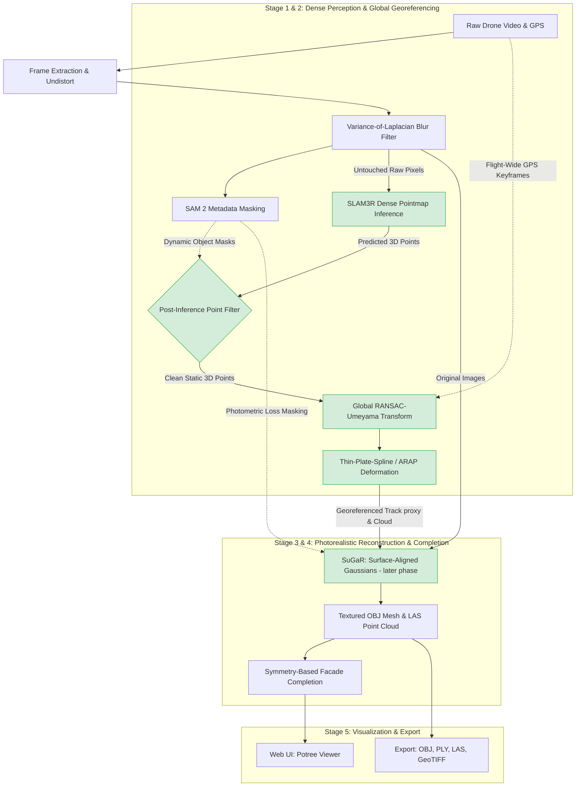

# Project ANTARA (Team HNM-OG): 5-Day Hackathon Execution Plan
*Finalized Reconstruction Architecture for SIH Problem Statement 17 (NTRO)*

This document outlines the execution plan for **Project ANTARA**. It consolidates the architecture review, incorporates the mathematical resolutions for all three identified flaws, and aligns with **SLAM3R's actual dense-pointmap architecture** and NTRO defense licensing requirements.

> **Implementation status (kept honest).** Days 1–2 and 4 are **built** in the
> `antara/` package (preprocess → real SLAM3R reconstruct → georeference →
> deliverables → honest evaluation). Day 3 (**SuGaR** textured meshing) and Day 5
> (**symmetry facade completion**) are **NOT implemented** — SuGaR is an approved
> *later* phase (seam documented in `antara/deliverables.py`; today's mesh is
> Open3D screened Poisson), and symmetry completion was dropped. This plan is the
> original 5-day strategy; see [setup_windows.md](setup_windows.md) for what
> actually runs. One correction carried through below: **SLAM3R exposes no explicit
> camera poses**, so the per-keyframe camera position is a *centroid proxy* from
> each registered pointmap, not a solved pose.

---

## System Architecture

---

## Execution Timeline (5-Day Hackathon)

### Day 1: The Minimum Viable Product (MVP) - Preprocessing & Ingestion
**Goal:** Ingest raw video, filter blur, generate dynamic masks, and synchronize GPS telemetry.

* **Task 1.1: Frame Sampling & Blur Filtering.** Sample frames down to 5 FPS. Use Variance-of-Laplacian scoring to drop motion-blurred frames.
* **Task 1.2: SAM 2 Dynamic Masking.** Run SAM 2 to detect vehicles and people. Store mask coordinates as separate metadata (`masks.npz`). **Do not alter or black out raw image pixels.**
* **Task 1.3: Telemetry Synchronization.** Parse drone GPS metadata and map every keyframe to its exact metric coordinates.

### Day 2: SLAM3R Dense Reconstruction & Global Georeferencing
**Goal:** Generate an internally coherent, metric-scale 3D point cloud and camera trajectory.

* **Task 2.1: SLAM3R Dense Pointmap Inference.** Run SLAM3R continuously with sliding-window overlap on raw frames to produce dense 3D pointmaps.
* **Task 2.2: Post-Inference Point Filtering (Refinement A).** Discard any predicted 3D points that fall inside the SAM 2 dynamic masks at the output stage. (Preserves SLAM3R's neural perception while purging dynamic obstacles).
* **Task 2.3: Global RANSAC-Umeyama Solve (Refinement B).** Fit **one global** 7-DOF similarity transform across the whole flight path using GPS keyframes (eliminating the ill-conditioned collinear chunk problem).
* **Task 2.4: Thin-Plate Spline (TPS) Residual Correction.** Apply TPS / As-Rigid-As-Possible (ARAP) deformation to smooth out residual local curvature drift using GPS control points.

### Day 3: Surface Reconstruction & Texturing with SuGaR
**Goal:** Extract a genuinely textured, watertight mesh and dense point cloud.

* **Task 3.1: Initialize SuGaR with the georeferenced trajectory.** Feed Stage 2's georeferenced camera-center track (the pointmap-centroid proxy, since SLAM3R has no explicit poses) and raw frames into SuGaR. *(Deferred phase — not yet implemented.)*
* **Task 3.2: Photometric Loss Masking.** During Gaussian optimization, mask out SAM 2 dynamic-object pixels from the photometric loss so moving objects are never baked into the splat field.
* **Task 3.3: Surface-Aligned Mesh Extraction.** Cap training at 7,000 iterations (~8 mins) and extract the surface mesh via SuGaR's regularized Poisson step. Color is carried natively through the optimized spherical harmonics.

### Day 4: Deliverables, Formats & Web UI
**Goal:** Meet all explicit deliverables in the Problem Statement.

* **Task 4.1: Standard Formats.** Export final model to OBJ, PLY, and LAS (using `laspy`).
* **Task 4.2: Top-Down Orthomosaic (GeoTIFF).** Render an orthographic top-down projection and write georeferenced metadata via `rasterio`.
* **Task 4.3: Local Web Viewer.** Run `PotreeConverter` on the LAS output and serve the interactive 3D viewer locally on port 8000.

### Day 5: Symmetry Completion & Pitch Rehearsal
**Goal:** Maximize the 15% "Innovation" score.

* **Task 5.1: Symmetry-Based Facade Completion.** Run planar RANSAC + reflection symmetry detection on the extracted mesh to infer unobserved building sides.
* **Task 5.2: Stretch Goal:** Note PoinTr/AdaPoinTr point cloud completion for complex irregular occlusions.
* **Task 5.3: End-to-End Profiling.** Verify total execution stays within the **~12–16 minute** budget.

---

## Defense & Licensing Compliance (NTRO Alignment)

| Component | License | Compliance Status / Action |
| :--- | :--- | :--- |
| **SAM 2 (Meta)** | **Apache 2.0** | **Confirmed Clean:** No field-of-use or military restrictions. Air-gapped edge execution. |
| **SLAM3R** | **CC BY-NC-SA 4.0** (DUSt3R lineage) | Valid for research/hackathon prototype. |
| **3DGS / SuGaR** | **Inria Non-commercial** | Valid for prototype demonstration. |
| **Open3D / laspy / rasterio** | **MIT / BSD** | Fully permissive. |
| **Ruled Out: Meta VGGT** | **FAIR Noncommercial + AUP** | **Explicitly prohibits military/reconnaissance use.** Incompatible with NTRO. |
| **Ruled Out: Ultralytics YOLO** | **AGPL-3.0** | **Copyleft restriction.** Replaced by SAM 2. |

---

## Key Talking Points for Judges

1. **"We adapted our filtering to SLAM3R's dense architecture."** Explain that because SLAM3R is a dense regression network (DUSt3R lineage) rather than a sparse feature tracker, we filter the predicted 3D pointmap *post-inference* rather than modifying input pixels.
2. **"We avoided the ill-conditioned collinear chunk trap."** Highlight that instead of fitting unstable Umeyama transforms on short linear chunks, we fit one global RANSAC-Umeyama across the whole flight and resolve local drift with Thin-Plate Splines (TPS).
3. **"We recover position from pointmaps, not poses."** SLAM3R (DUSt3R lineage) regresses dense pointmaps and exposes no explicit camera poses, so we derive each keyframe's position as the confidence-weighted centroid of its registered pointmap — a documented, honest proxy — and georeference *that* against GPS.
4. **"Textured meshing is a scoped next phase."** The current deliverable mesh is Open3D screened Poisson (geometry, no texture). SuGaR's surface-aligned Gaussians for a genuinely textured OBJ are the approved follow-on; the integration seam is already in place in `antara/deliverables.py`.
